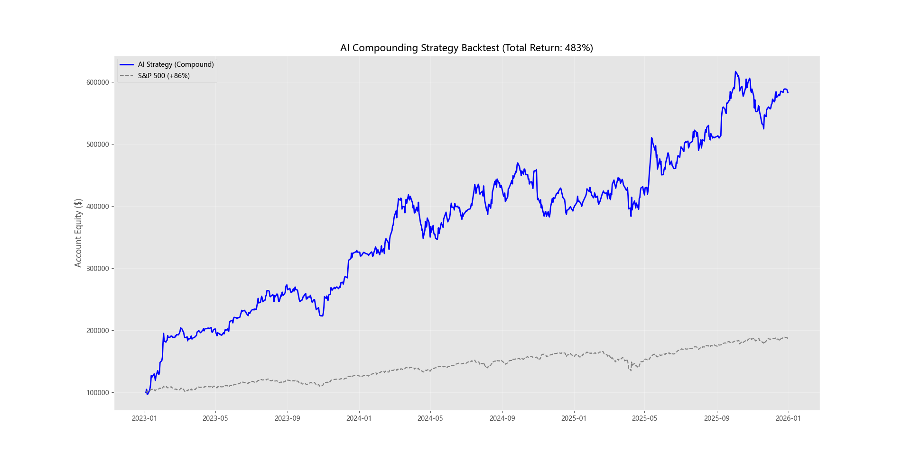
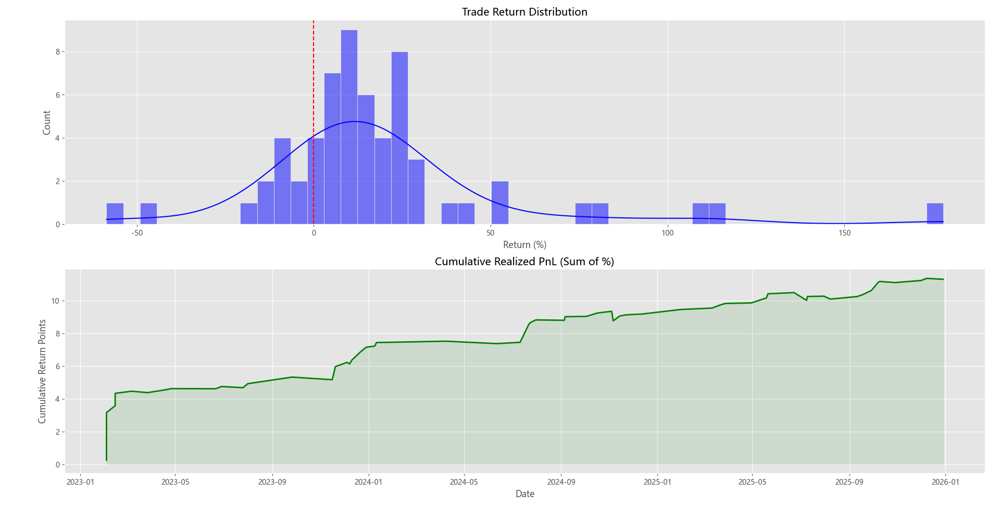
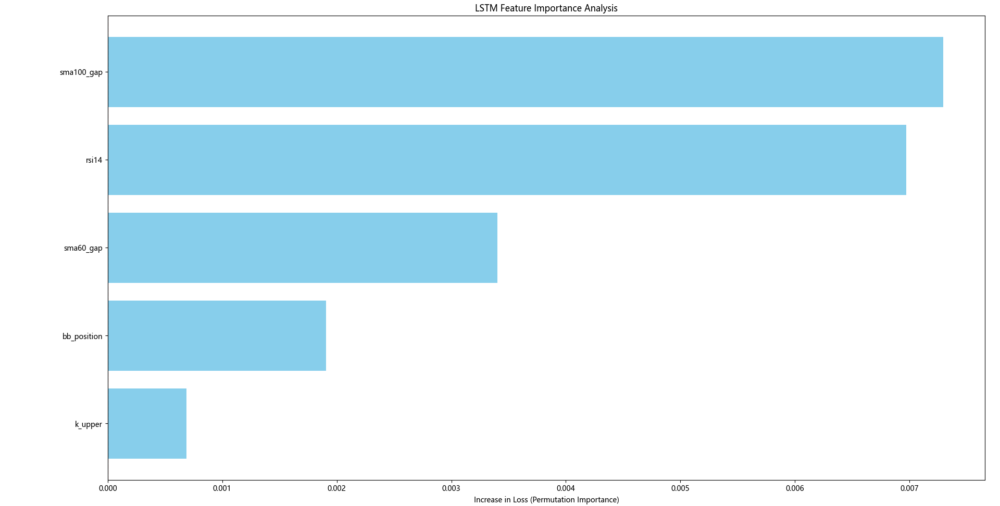

# AI-Powered Quantitative Trading System (LSTM)


## 📈 Executive Summary

This project implements an end-to-end algorithmic trading system leveraging **Deep Learning (LSTM)** to predict stock price movements and generate alpha. 

Unlike traditional price prediction models, this system focuses on **Cross-Sectional Alpha Scoring**—ranking stocks based on their relative strength against the market (SPY) and volatility metrics. The project demonstrates a complete quantitative workflow: from data ingestion and complex feature engineering to model training and event-driven backtesting.

**Key Performance Highlight (Backtest):**
- **Total Return:** +483% (vs SPY +86%) over the test period (2023-2026).
- **Strategy:** Dynamic position sizing with compounding capital.

---

## 📊 Performance Analysis

### 1. Equity Curve vs. Benchmark
The strategy significantly outperformed the S&P 500 benchmark during the out-of-sample testing period. The compounding effect and dynamic position sizing allowed the portfolio to capitalize on high-confidence signals.


*(Blue: AI Strategy | Grey: S&P 500 Benchmark)*

### 2. Risk & Return Distribution
The analysis of closed trades shows a positive skew in returns. The "Realized PnL" chart demonstrates steady capital appreciation with controlled drawdowns.



### 3. Model Interpretability (Feature Importance)
Using Permutation Importance, we identified that long-term trend indicators (`sma100_gap`) and momentum oscillators (`rsi14`) were the most critical drivers for the LSTM's decision-making process.



---

## 🛠 Project Structure

The codebase is modularized to mimic a production-grade quantitative pipeline:

```bash
├── getdata.py              # Data Ingestion: Downloads historical data via yfinance
├── indicator.py            # Library: Custom implementation of technical indicators (RSI, MACD, BOLL, etc.)
├── feature_engineering.py  # ETL Pipeline: Cleans data, generates factors, calculates Alpha Targets
├── train.py                # Modeling: PyTorch LSTM implementation with sliding window datasets
├── analyze_features.py     # Analysis: Permutation importance to interpret "Black Box" models
├── backtest.py             # Simulation: Event-driven backtester with dynamic portfolio management
└── analyze_trade.py        # Reporting: Generates visualizations and financial metrics (Sharpe, Win Rate)
```

## 💻 Installation & Usage

### Prerequisites
```bash
pip install torch pandas numpy matplotlib seaborn yfinance scikit-learn tqdm joblib
```

### Workflow
1.  **Download Data:**
    ```bash
    python getdata.py
    ```
2.  **Generate Features:**
    ```bash
    python feature_engineering.py
    ```
3.  **Train Model:**
    ```bash
    python train_model.py
    ```
4.  **Run Backtest:**
    ```bash
    python backtest.py
    ```
5. **Analyze Results:**
    ```bash
    python analyze_features.py analyze_trade.py 
    ```

    
